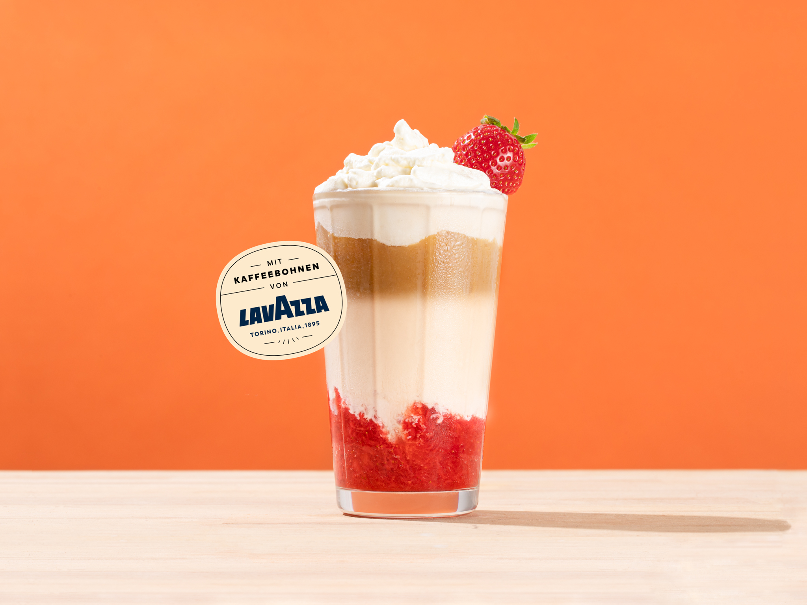

# Cozy-Cup-Cafe

## Project Description
Cozy Cup Cafe is a web application designed to enhance the cafe experience for both customers and cafe owners. It provides a user-friendly platform for customers to browse the menu, place orders, and enjoy a seamless cafe experience. Cafe owners can manage their menu, track orders, and connect with their customers efficiently.

## Features
- Menu Management: Easily update and manage the cafe menu, including adding new items, updating prices, and marking items as unavailable.
- Order Placement: Customers can browse the menu, add items to their cart, and place orders with just a few clicks.
- Order Tracking: Real-time order tracking for both customers and cafe owners, ensuring a smooth and transparent order fulfillment process.
- Customer Engagement: Cafes can engage with their customers by sending notifications, promotions, and personalized offers.
- User Authentication: Secure user accounts with authentication for both customers and cafe owners.
- Feedback System: Gather valuable feedback from customers through a built-in review and rating system.

## Screen Captures

Description:Step into a realm where every sip is accompanied by an orchestra of cozy whispers and the warm embrace of our enchanting coffee shop ambiance. The air is infused with the aromatic dance of freshly ground coffee beans, creating a symphony that beckons you to unwind and savor the moment.

Soft, ambient lighting casts a gentle glow upon a tapestry of rustic and modern elements, creating a harmonious blend of comfort and style. Plush seating invites patrons to linger, while the subtle hum of conversations and the occasional clink of porcelain cups compose a melody that soothes the soul.

Natural light pours through large windows, creating a serene atmosphere that transcends the ordinary. Lush greenery and tasteful decor contribute to an aesthetic that is both inviting and inspiring, making our coffee shop a haven for creativity, relaxation, and connection.

Description: In this captivating snapshot, the ambiance of our coffee shop comes to life as customers savor moments of tranquility and connection. The gentle hum of conversation mingles with the aromatic symphony of freshly brewed coffee, creating an atmosphere that is both inviting and energizing.

Description: Embark on a culinary journey with our cherished best seller, Heavenly Harvest Bread, a delightful creation that has become the heart and soul of our coffee shop.

Crafted with passion and precision, this artisanal bread is a testament to the perfect blend of tradition and innovation. The crust, golden and crisp, encases a soft, pillowy interior that's a canvas for the rich tapestry of flavors within.

Description: Indulge in the unparalleled experience of our best seller, Cloud Coffee. Crafted with precision and passion, this exquisite blend takes you on a journey to the clouds with every sip.

Cloud Coffee boasts a harmonious balance of rich, full-bodied flavors and a velvety smooth texture that caresses your palate. Our expertly selected beans are roasted to perfection, creating a delightful symphony of nutty undertones, hints of chocolate, and a subtle sweetness that lingers.

# About the Authors

**Name: IAN GABRIEL F. DALIMOCON**

**Email:** fetalverian@gmail.com

Connect with me on:
- [Email](mailto:fetalverian@gmail.com)
- 
- 

