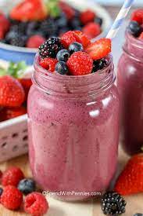

# Cozy-Cup-Cafe

## Project Description
Cozy Cup Cafe is located at Brgy. Sicsican and a service of quality hot and cold  various types of coffee, espresso and cappuccino and Non- Coffe drink like Strawberry Latte , Mixed Berrys.

## Features

- Ambiance:Warm and inviting decor.
Comfortable seating arrangements.
- Beverages:A variety of coffee and tea options.
Specialty drinks and seasonal offerings.
Quality espresso-based beverages.
- Menu:Breakfast and lunch menu items.
Pastries, desserts, and snacks.
Dietary options for various preferences (e.g., vegetarian, vegan, gluten-free).
- Atmosphere:Soft background music.
Adequate lighting for reading or working.
Wi-Fi availability for customers.
- Community Engagement:Events like open mic nights, book clubs, or art exhibits.
Support for local artists or musicians.
- Customer Service:Friendly and attentive staff.
Efficient order processing.
- Seating Options:Comfortable seating arrangements, including couches or armchairs.
Outdoor seating, if applicable.

## Screen Captures

In Italian, espresso means "pressed out," from the Latin exprimere, "squeeze out."Strong black coffee brewed by forcing hot water under pressure through finely ground coffee beans. types: caffe latte, latte. strong espresso coffee with a topping of frothed steamed milk.

It is the diminutive form of cappuccio in Italian, meaning "hood" or something that covers the head, thus cappuccino literally means "small capuchin". The coffee beverage has its name not from the hood but from the color of the hooded robes worn by friars and nuns of the Capuchin order

A strawberry latte is a flavored latte beverage that combines the rich and creamy texture of a traditional latte with the fruity and sweet taste of strawberries. The drink typically includes espresso, steamed milk, and a strawberry-flavored syrup or puree.

Mixed berry drinks typically involve combining a variety of berries to create a refreshing and flavorful beverage. 

# About the Authors

**Name: Jay Evan Willis Lagutan**

**Email:** jaylagutan02@gmail.com

